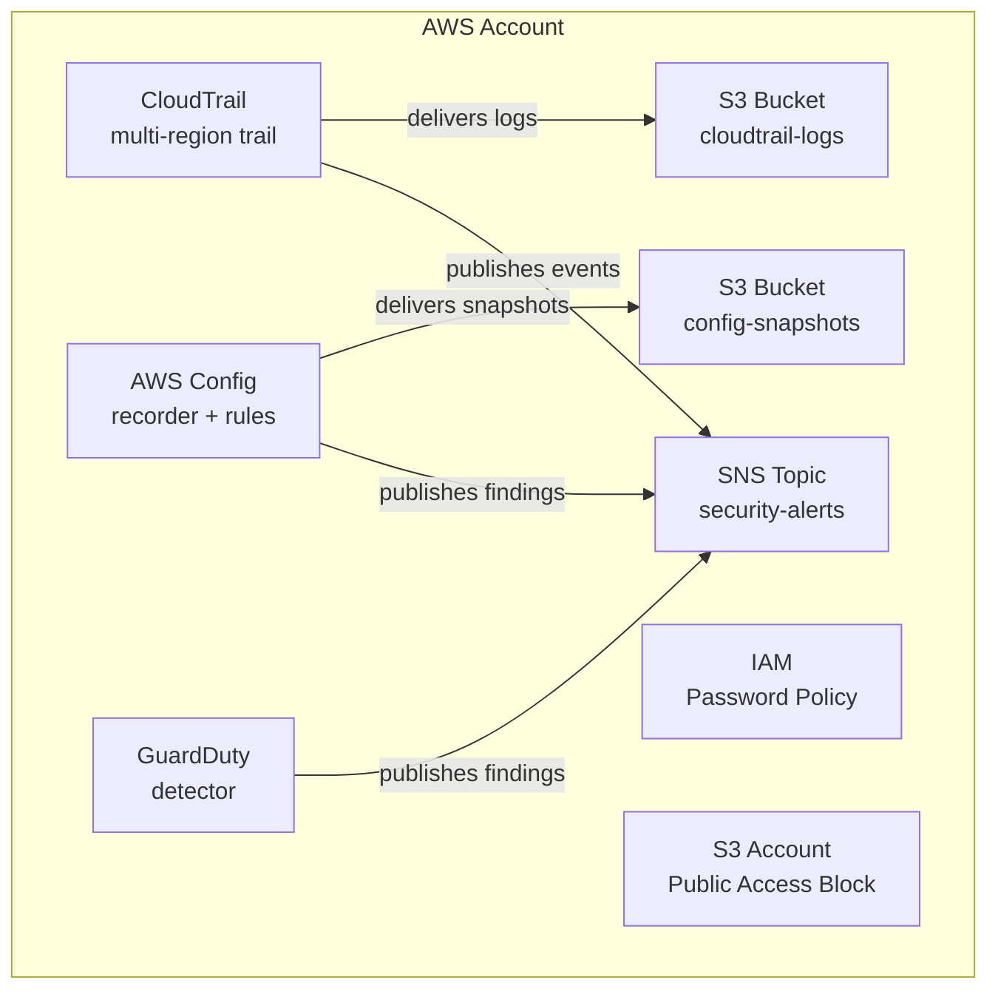

# aws-baseline-terraform

> Terraform module that bootstraps a new AWS account with the security controls a platform
> team needs on day one — before any workloads land.

---

## Problem statement

Every AWS account needs the same handful of security primitives: an audit trail, configuration
drift detection, threat detection, a hardened password policy, and a place for alerts to land.
Setting these up manually is error-prone, easy to forget, and impossible to audit. This module
gives a platform team a single `module` block that provisions all of them consistently across
every account in an organization, with sane secure defaults and per-account toggle overrides
for cost-sensitive environments. It is intentionally scoped to *account-level* baseline
controls — not application workloads — and is designed to be composed with workload modules,
not to replace them.

---

## Architecture



---

## Quickstart

```hcl
provider "aws" {
  region = "us-east-1"

  default_tags {
    tags = {
      Environment = "production"
      Team        = "platform"
    }
  }
}

module "baseline" {
  source = "github.com/your-org/aws-baseline-terraform"

  name_prefix = "acme-prod"

  tags = {
    CostCenter = "platform-shared"
  }
}

output "security_alerts_topic" {
  value = module.baseline.sns_topic_arn
}
```

See [`examples/complete/`](examples/complete/) for a full working example with all toggles
demonstrated.

---

## Variables

<!-- BEGIN_TF_DOCS -->
<!-- terraform-docs markdown . will replace this block. Run: terraform-docs markdown . > README.md -->
<!-- END_TF_DOCS -->

---

## Outputs

| Name | Description |
|------|-------------|
| `cloudtrail_arn` | ARN of the CloudTrail trail |
| `cloudtrail_s3_bucket_name` | S3 bucket receiving CloudTrail logs |
| `sns_topic_arn` | ARN of the security alerts SNS topic |
| `guardduty_detector_id` | GuardDuty detector ID |
| `config_recorder_id` | AWS Config recorder ID |
| `config_s3_bucket_name` | S3 bucket receiving Config snapshots |

---

## Design decisions and trade-offs

### Why these specific Config rules?

The nine rules in the default set represent the highest-signal, lowest-noise baseline for
an account that has not yet been hardened. They cover four threat categories:

1. **Credential hygiene** — `IAM_PASSWORD_POLICY`, `IAM_ROOT_ACCESS_KEY_CHECK`,
   `ACCESS_KEYS_ROTATED` catch the most common path to account compromise: leaked or
   long-lived credentials.
2. **Data exposure** — `S3_BUCKET_PUBLIC_READ_PROHIBITED` and
   `S3_BUCKET_SERVER_SIDE_ENCRYPTION_ENABLED` close the two most common causes of data
   breach in AWS (accidental public buckets and unencrypted objects).
3. **Compute hygiene** — `ENCRYPTED_VOLUMES` and `VPC_DEFAULT_SECURITY_GROUP_CLOSED`
   prevent data exfiltration via snapshot copy and lateral movement via the default SG.
4. **Control-plane hygiene** — `CLOUD_TRAIL_ENABLED` and `GUARDDUTY_ENABLED_CENTRALIZED`
   detect when someone disables your detection layer.

Rules intentionally excluded from the default set: anything requiring cross-account
aggregator configuration (e.g., `MULTI_REGION_CLOUD_TRAIL_ENABLED` — CloudTrail handles
this directly), rules with high false-positive rates in early-stage accounts, and rules
that duplicate GuardDuty's coverage.

### Cost implications of GuardDuty and Config

Both services have meaningful per-account cost:

- **GuardDuty** charges per analyzed event volume. In a quiet account the floor is roughly
  $3–5/month; in a busy account with VPC Flow Logs and DNS logs enabled it can reach
  $50+/month. The `enable_guardduty` toggle exists specifically for cost-sensitive
  dev/sandbox accounts. **Never disable it in production.**
- **AWS Config** charges $0.003 per configuration item recorded plus $0.001 per rule
  evaluation. In an active account with many resource types this adds up. The
  `config_delivery_frequency` variable (default: `TwentyFour_Hours`) controls snapshot
  cost; more frequent delivery increases cost linearly.

### Why `default_tags` over resource-level tags?

The AWS provider's `default_tags` block propagates tags to all resources created by that
provider instance without requiring every `resource` block to repeat them. This eliminates
tag drift (resources created without tags), reduces boilerplate, and means tag updates
propagate in a single `terraform apply`. The trade-off: `default_tags` don't appear in
`terraform plan` output as cleanly as explicit resource tags, and a small number of resource
types don't support provider-level tagging (e.g., `aws_iam_account_password_policy`). This
module applies `local.common_tags` explicitly on those resources.

### When this module is NOT the right choice

- **Accounts managed by AWS Control Tower** — Control Tower's Account Factory and Service
  Control Policies (SCPs) provision equivalent controls centrally. Running this module
  alongside Control Tower creates duplicate recorders, conflicting Config rules, and
  potentially competing CloudTrail trails. Use this module only for accounts enrolled in
  Control Tower via `customizations-for-control-tower` or as a reference for what Control
  Tower's baseline should look like.
- **Accounts in an AWS Organizations with a delegated security account** — GuardDuty and
  Config both support centralized management from a delegated administrator account. In
  that topology, enable GuardDuty/Config at the org level rather than per-account.
- **Accounts that already have a security baseline** — Running this module against an
  account with an existing CloudTrail trail will create a second trail and double log
  delivery costs. The `enable_*` toggles allow selective adoption, but a careful audit
  is recommended before running `terraform apply`.

---

## What I'd do differently at scale

### AWS Organizations and Control Tower integration

At scale, account-level modules like this are the wrong abstraction. The right architecture:

1. **Delegated administrator accounts** — GuardDuty, Security Hub, Config, and CloudTrail
   all support org-level management. A single delegated admin account receives findings and
   logs from every member account without per-account module runs.
2. **Account Factory for Terraform (AFT)** — AFT is the production-grade pattern for
   bootstrapping new accounts in a Control Tower org. This module's logic maps directly to
   an AFT "global customization" that runs automatically on every new account vend.
3. **Service Control Policies (SCPs)** — SCPs in the management account can prevent
   disabling CloudTrail, Config, or GuardDuty even if someone has `iam:*` in a member
   account. This module cannot enforce that — an SCP can.

### Multi-account considerations

- S3 log buckets should live in a **dedicated log archive account**, not the account being
  baselined. This requires cross-account bucket policies. The current module puts logs in
  the same account for simplicity; at scale that's a conflict of interest (an attacker with
  sufficient permissions can delete logs in the same account).
- Config aggregation should point to a **security/audit account** so findings are visible
  org-wide without requiring per-account dashboard access.

### Drift detection strategy

`terraform apply` in a pipeline is not a drift strategy — it's a correction strategy.
Real drift detection requires:

1. **AWS Config** (already provisioned by this module) — continuous drift detection with
   remediation actions via SSM Automation.
2. **Scheduled `terraform plan` in CI** — a read-only plan run on a schedule (e.g., nightly)
   that posts a summary to Slack/SNS if drift is detected. This module's GitHub Actions
   workflow can be extended with a `plan` job that runs on schedule and fails if the plan
   is non-empty.
3. **Config conformance packs** — for orgs with hundreds of accounts, conformance packs
   deploy rule sets at the org level and aggregate compliance scores in Security Hub.

---

## Contributing

```bash
# Install terraform-docs
brew install terraform-docs

# Regenerate the variable reference in README.md
terraform-docs markdown . --output-file README.md

# Run pre-commit checks locally (mirrors the GitHub Actions workflow)
terraform fmt -recursive .
terraform validate
tflint --init && tflint
```

See [CONTRIBUTING.md](CONTRIBUTING.md) for full guidelines.

---

## Tested with

| Tool | Version |
|------|---------|
| Terraform | `>= 1.7.0` |
| AWS Provider | `>= 5.40.0` |
| tflint | `>= 0.50.0` |
| tfsec | `>= 1.28.0` |
